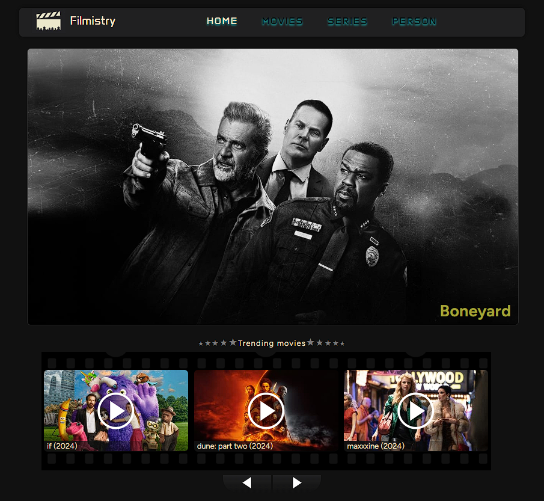
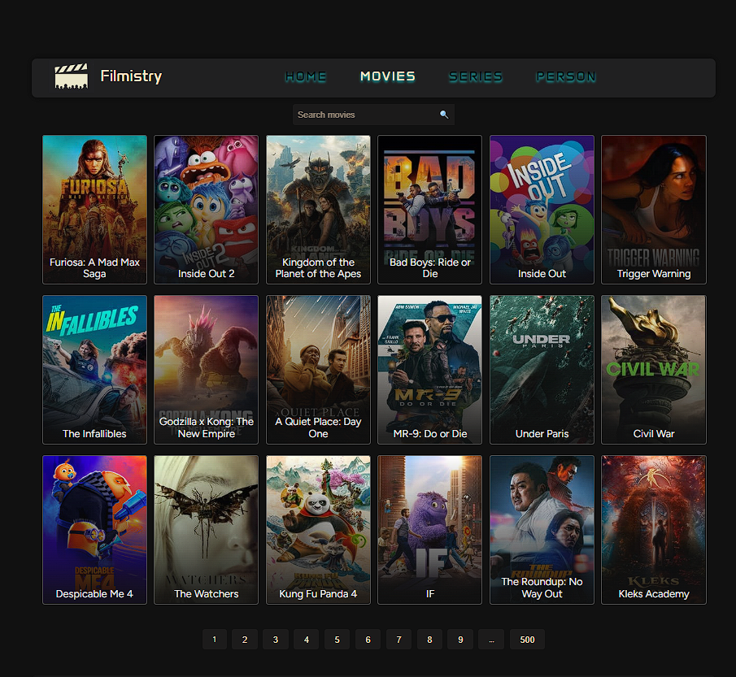
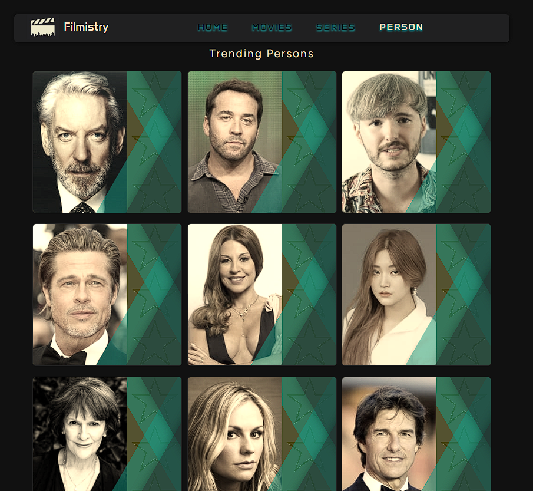
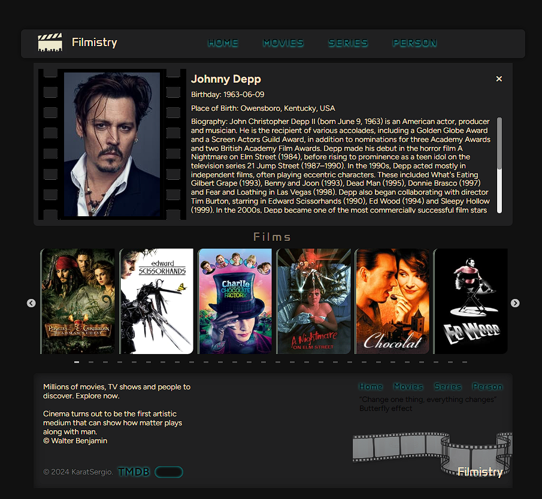
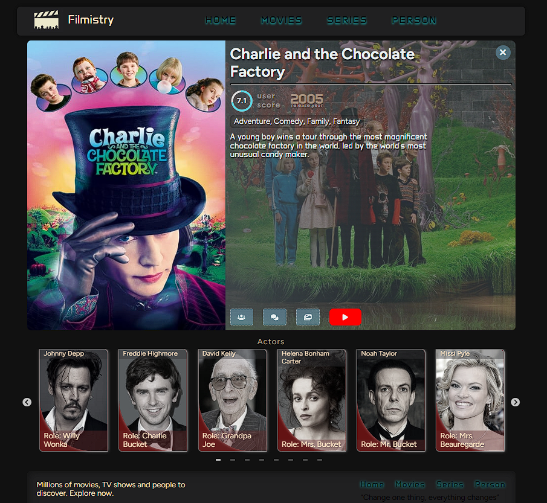
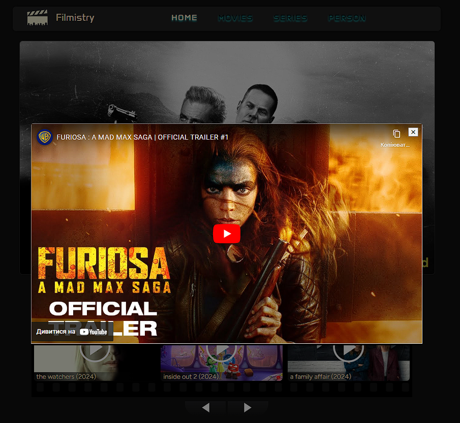

**Read in another language: [Ukrainian](README.ua.md).**

# Movie search site "Filmistry"

The project involves working with the TMDb API to retrieve information about
movies. It is a React-based front-end application that allows users to search
for movies, view movie information, and interact with various functions provided
by the TMDb API

## Table of contents

- [Project overview](#project-overview)
- [Technologies used](#technologies-used)
- [Installation](#instalattion)
- [Server Commands](#server-commands)

## Project Overview

Uses modern technologies such as React, Redux Toolkit for state management,
Axios for API requests and react-slick for creating sliders. Pagination and
routing have been implemented for easy navigation around the site.

## Technologies Used

- React
- Redux
- axios
- redux-thunk
  
- react-router-dom
- redux-persist api
- YouTube API
- TMDb API

## Installation

1. Clone this repository to your local computer.
2. Open the terminal and navigate to the root folder of the project.
3. Run the command `npm install` to install project dependencies.

## Server Commands

**npm:**

- `npm start` — Start the server in production mode.
- `npm run start:dev` — Start the server in development mode.
- `npm run lint` — Run code linting using eslint. Perform this before each PR
  and fix all linting errors.
