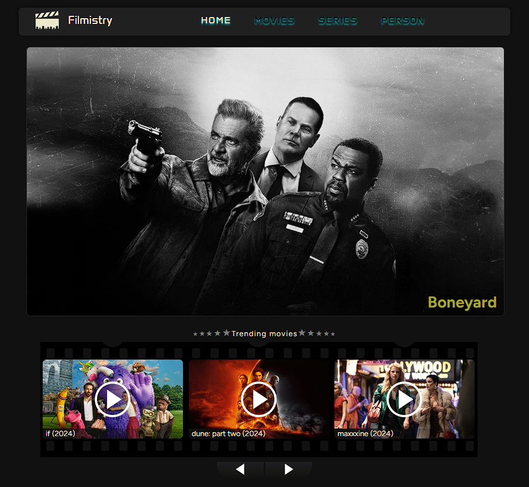
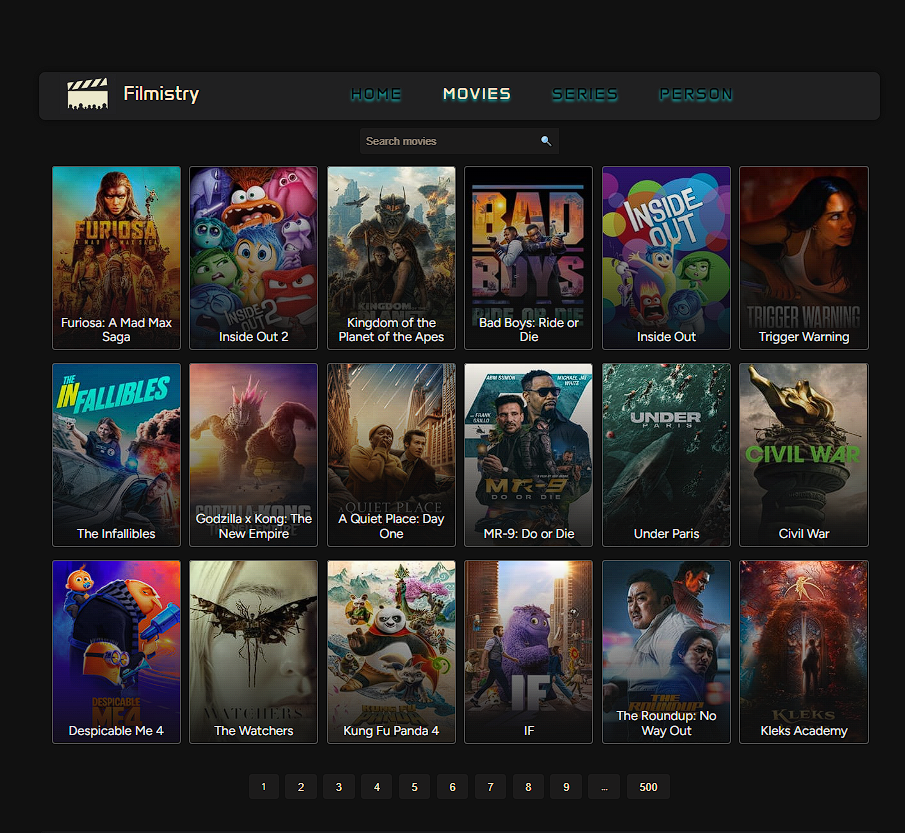
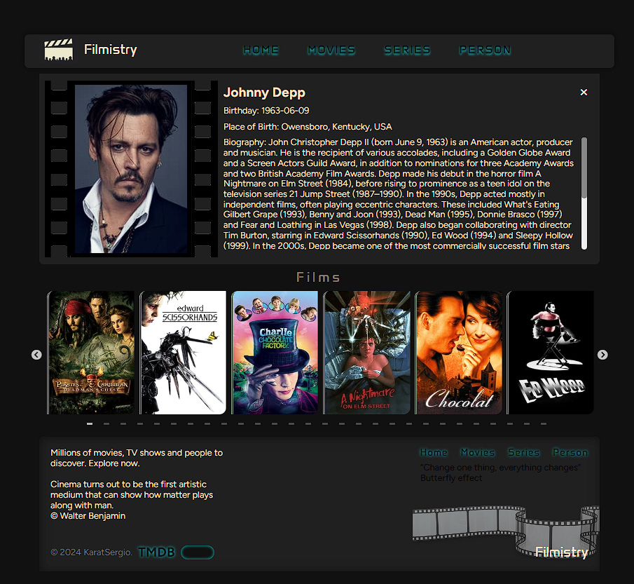
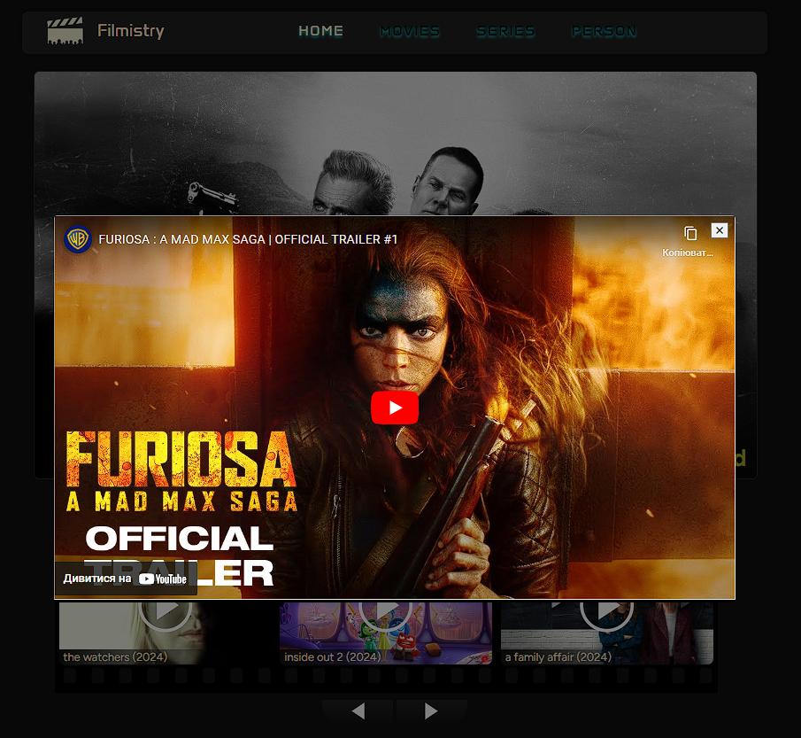

**Читати іншою мовою: [Англійська](README.md).**

# Сайт з пошуку фільмів "Filmistry"

Проект передбачає роботу з API TMDb для отримання інформації про фільми. Це інтерфейсна програма на основі React, яка дозволяє користувачам шукати фільми, переглядати інформацію про фільми та взаємодіяти з різними функціями, наданими TMDb API...

## Зміст

- [Огляд проекту](#огляд-проекту)
- [Використані технології](#використані-технології)
- [Інсталяція](#інсталяція)
- [Конфігурація](#конфігурація)
- [Команди сервера](#команди-сервера)

## Огляд проекту

Використовуються сучасні технології, такі як React, Redux Toolkit для керування станом, Axios для API-запитів та react-slick для створення слайдерів. Реалізовано пагінацію та роутинг для зручної навігації по сайту.

## Використані технології

- React
- Redux
- axios
- redux-thunk
- react-router-dom
- redux-persist
api
- YouTube API
- TMDb API

## Інсталяція

1. Склонуйте цей репозиторій на свій локальний комп'ютер.
2. Відкрийте термінал і перейдіть до кореневої теки проекту.
3. Запустіть команду `npm install`, щоб встановити залежності проекту.

## Команди сервера

**npm:**

- `npm start` — Запустити сервер у режимі продакшену.
- `npm run start:dev` — Запустити сервер у режимі розробки.
- `npm run lint` — Запустити лінтування коду за допомогою eslint. Виконайте це перед кожним PR та виправте всі помилки лінтування.
